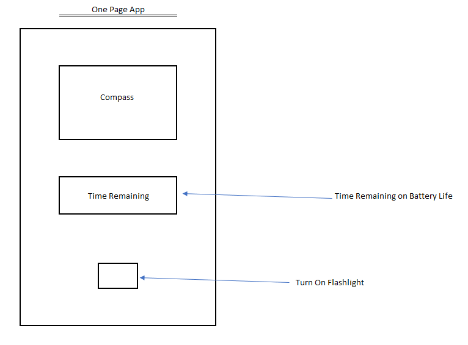

# Xamarin Project - Survival Basics

## Authors: Alan Hung

### About Application
This application is your basic Application that provides your basic needs if you ever get lost while hiking.  It provides a compass that will always point to North, a Button that will turn on your phone camera's light, and a display to estimate the amount of time you have left in your battery life.

### Example
* 
* 

### Getting Started
* Open Visual Studio
* Clone [Xamarin Project Git Repository](https://github.com/AlanYHung/dotnetXamarin)
* Click Run

### Change Log
* 0.0.1 - 3/02/2021 9:13pm - Set up initial repo
* 0.0.2 - 3/02/2021 9:13pm - Set Up Page Layout for App

### Attribution
* [Microsoft Docs](https://docs.microsoft.com/en-us/dotnet/csharp/language-reference/)
